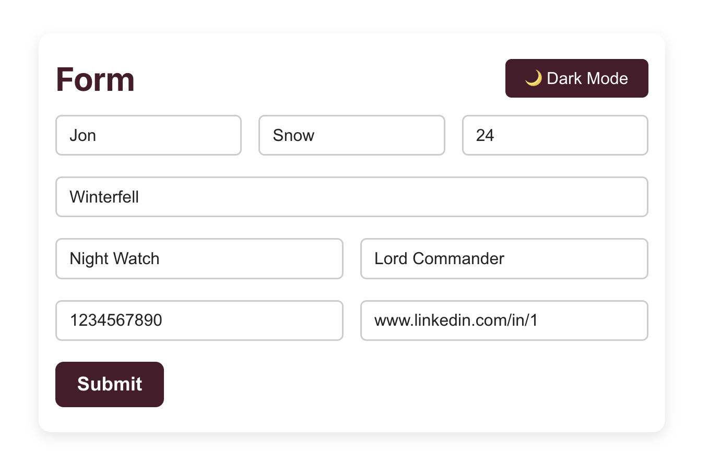
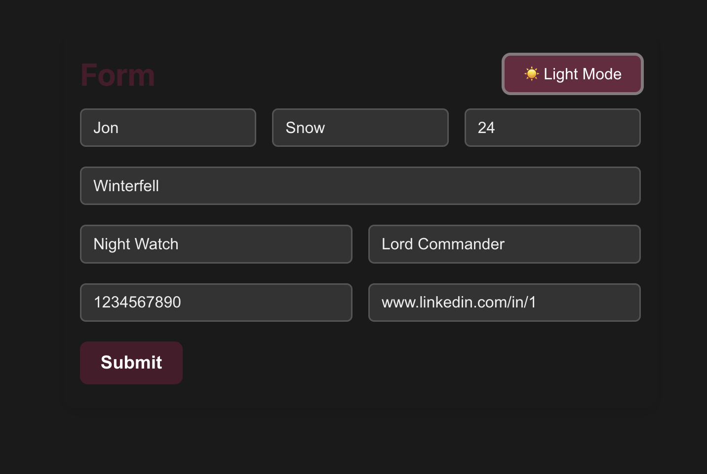
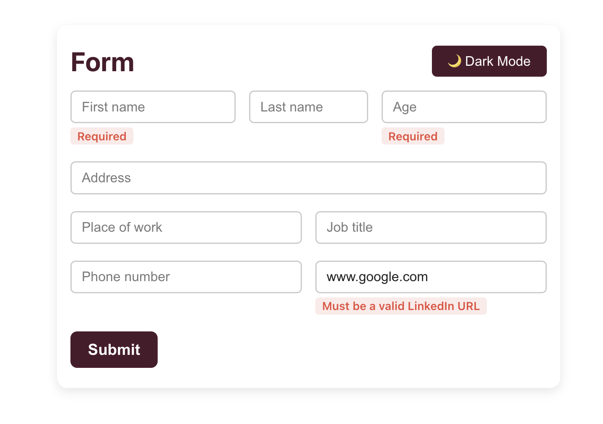

# 📝 React Form App with Toast Notification, Theme Toggle, and Validation

This is a React-based form application featuring live validation, data persistence, dark mode toggle, animated toast notifications, and backend integration via Vercel Serverless Functions.

---

## ✨ Features

### ✅ Form Fields

- **First Name**
- **Last Name**
- **Age** (must be a positive integer)
- **Address**
- **Place of Work**
- **Job Title**
- **Phone Number**
- **LinkedIn URL** (must be a valid link in the format `linkedin.com/in/...`)

### 🌒 Dark Mode Toggle

- Toggle between light and dark themes.
- User preference is saved in `localStorage`.

### 📂 Data Persistence

- Form data is auto-saved to `localStorage` on change.
- If the page reloads or the user navigates away, progress is not lost.
- Upon successful submission, localStorage is cleared.

### 🚀 Animated Toast Notification

- Upon successful submission, a centered toast fades in and then slides out to the right.
- The toast message auto-dismisses after 3 seconds.

### 🛄 Backend Submission

- Form data is submitted via a [Vercel Serverless Function](https://vercel.com/docs/functions).
- Error handling included (e.g., alerts user if submission fails).

### 🔍 Validation with Yup

- All fields are validated using [Yup](https://github.com/jquense/yup).
- Real-time error messages shown under each input on blur or submit.

---

## Screenshots

### 💡 Light Mode



### 🌙 Dark Mode



### ⚠️ Error Message Example



---

## 🛠 Tech Stack

- **React**
- **Formik** for form state management
- **Yup** for validation
- **CSS Modules** for styling and animations
- **Vercel Serverless Functions** for backend submission
- **localStorage** for data persistence
- **Custom Toast Notification** (CSS animated)

---

## 📁 Folder Structure

```
form-app/
├── public/
│   └── ...
├── src/
│   ├── App.jsx
│   ├── App.css
│   └── ...
├── api/
│   └── submit.js
├── screenshots/
│   ├── light-mode.png
│   ├── dark-mode.png
│   └── error-message.png
├── package.json
└── README.md
```

---

## 🔄 Deployment

This app is deployed using **Vercel**. If you're deploying your own version:

1. Push your project to a GitHub repo.
2. Connect the repo to Vercel.
3. Ensure `api/submit.js` is picked up as a Serverless Function.
4. Update any environment variables if needed.

---

## 🔐 Notes

- Toast and theme logic is handled purely on the frontend.
- The form will only reset when the submission is **successful**.
- The app uses semantic HTML and basic accessibility best practices.

---

## 📬 Contact

For any questions or feedback, feel free to reach out!

---

## 🌐 Live Demo

[Click here to view the deployed app](https://form-app-three-sandy.vercel.app/)
